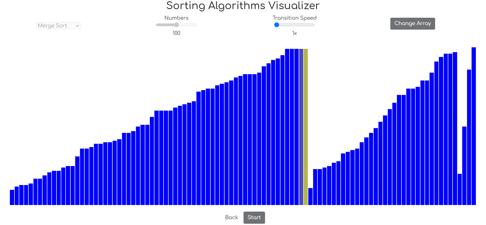
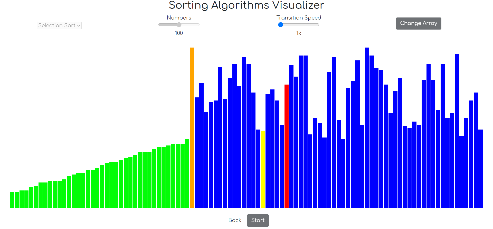

# Algorithms Visualizer
This project aims to visualize various algorithms such as Bubble Sort, Merge Sort, DFS, BFS etc.
Untill now, it has Sorting Algorithms only.
See the hosted project from [here](https://whohet.github.io/Algorithms-Visualizer/).
# Sorting Algorithms

Following lists of sorting algorithms is currently being visualized : 

 - Bubble Sort
 - Insertion Sort
 - Selection Sort
 - Merge Sort
 - Quick Sort

# Images

